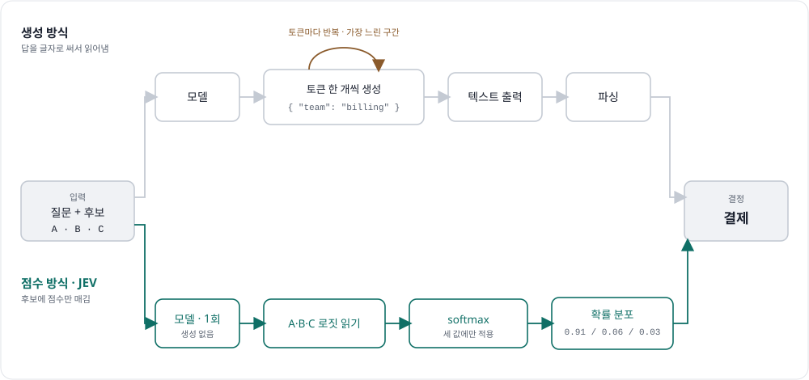

# Local JEV — a fast, local decision engine

Turn an open-source LLM into a **decision engine** without retraining it.

Many LLM calls don't need newly written text. The application already knows
the possible answers; it only needs the model to *choose* one. Instead of
asking the model to write a sentence or a JSON object and then parsing it,
this project reads the model's next-token logits for a fixed set of answers
and returns a probability distribution over them — in a single request.

```
billing             0.91
technical support   0.06
account access      0.03
```

This reproduces the **Jev inference pattern** locally using
[SGLang](https://github.com/sgl-project/sglang)'s `/v1/score` endpoint. It
recreates the *inference path* only — not Jev's training/calibration work.

## Scoring vs. generation, side by side

<picture>
  <source media="(prefers-color-scheme: dark)" srcset="docs/jev-compare-dark.svg">
  
</picture>

Same input (left) and same decision (right) — only the middle differs. The
generation lane loops token-by-token and then parses free text; the scoring
lane runs the model **once**, reads the logits for `A`/`B`/`C`, and normalizes
just those three. The token-generation loop is the slow part the scoring path
never enters.

## Why scoring, not generation

| | What the server does | What you get back |
|---|---|---|
| **Text generation** | writes tokens one at a time | free text you must parse |
| **Structured output** | still writes tokens (`{`, field, value, `}`) | a valid object, one answer |
| **Fixed-answer scoring** | one forward pass, reads N logits, restricted softmax | a probability distribution over known answers |

Structured output constrains the *syntax* of a written answer. Fixed-answer
scoring removes writing entirely — it only applies when the output space is
known before inference and each answer maps to a distinct action.

## How it works

The application supplies a query and the allowed answers. Each answer gets a
**single-token letter label** (`A`, `B`, `C`, …) placed at the end of the
prompt, with its meaning written into the prompt so the model still reads the
semantics:

```
Input:
I was charged twice for the same subscription.

Allowed labels:
A = billing questions and payment problems
B = product errors and technical failures
C = login, password, and account access problems

Return only the label.
Label:
```

At the `Label:` position the scoring path:

1. finds the token IDs for `A`, `B`, `C` (and **verifies each is one token**);
2. reads those three logits from the vocabulary-sized output vector;
3. ignores every other logit;
4. applies softmax **across only those three values**.

The normalization is *restricted to the declared choices* — we ask how the
model divides its preference among A/B/C, not across the whole vocabulary.
Labels never leave the scoring client: the app sends semantic answers and
gets semantic answers back.

> Add an `other` / `escalate` answer when the listed choices may not be
> exhaustive — otherwise restricted softmax puts all probability mass on the
> named options even when none is right. The datasets here do this.

## Layout

```
local_jev/
├── run_server.sh          # launch SGLang with an open model
├── decide.py              # single-request walkthrough (5 steps)
├── benchmark.py           # scoring vs generation: latency + accuracy
├── datasets.py            # labeled cases: support / screening / expense
├── requirements.txt
└── jev/
    ├── prompt.py          # build labeled-choice prompts
    ├── tokenize_labels.py # resolve labels -> single token ids (+ validate)
    └── engine.py          # decide() and generate_response()
```

## Run it

```bash
python3 -m venv .venv && source .venv/bin/activate
pip install -r requirements.txt          # needs a CUDA GPU for SGLang

# Terminal 1: start the model server (keep running)
./run_server.sh                           # defaults to Qwen/Qwen2.5-0.5B-Instruct

# Terminal 2: single decision
python decide.py

# Terminal 2: benchmark scoring vs generation on 100 cases
python benchmark.py --n 100
```

Pick a different model with `MODEL=Qwen/Qwen3-4B-Instruct-2507 ./run_server.sh`
and `JEV_MODEL=Qwen/Qwen3-4B-Instruct-2507 python decide.py`. Any open model
whose labels tokenize to single tokens works (Qwen 2.5 / 3, DeepSeek-R1-Distill,
SmolLM2, TinyLlama, …).

### Example: `decide.py`

```json
{
  "decision": "billing and payments",
  "margin": 0.3669,
  "latency_ms": 41.2,
  "probabilities": {
    "billing and payments": 0.6778,
    "technical support": 0.3109,
    "account access": 0.0114
  }
}

=> send to human review (top=0.68, margin=0.31)
```

The `0.678` is billing's share of probability mass *over these three choices*
— not a claim the model is right 68% of the time. Turning a score into a
calibrated confidence needs labeled data; the routing thresholds
(`>= 0.70`, margin `>= 0.20`) live in application code, where they can be
tested and changed.

### Example: `benchmark.py`

Both lanes run concurrently against one server, released together by a
barrier, each firing its next request as soon as the previous returns:

```
lane      n   accuracy   median_ms    mean_ms     p95_ms
------------------------------------------------------------
jev     100    92.00%         38.4       41.7       58.9
llm     100    88.00%        210.6      233.1      402.7

Scoring is ~5.5x faster than generation at the median.
```

(Exact numbers depend on GPU, model, and precision.) Scoring is faster
because it never enters the decode loop, and it can't emit an unparseable
answer — a failure mode that counts against the generation lane.

The gap above comes straight from the two paths: the `llm` lane pays for the
token-generation loop plus a parse, while the `jev` lane runs the model once
and reads the logits.

<picture>
  <source media="(prefers-color-scheme: dark)" srcset="docs/jev-compare-dark.svg">
  
</picture>
